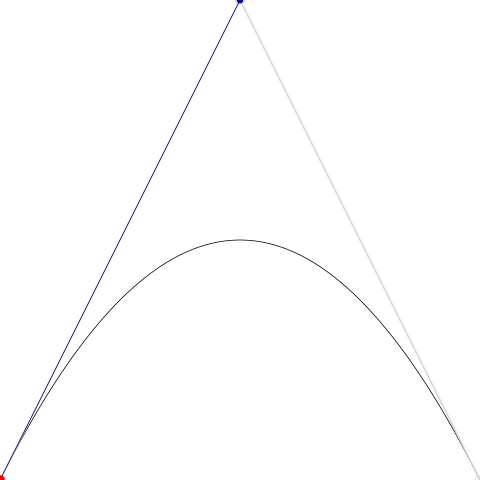

<!-- README.md is generated from README.Rmd. Please edit that file -->

# bezieR

<!-- badges: start -->
<!-- badges: end -->

The goal of bezieR is to It helps visually analyze Bezier curves and
animate their construct function of *f*(*t*). It was inspired by
[Wikipedia
visualization](https://en.wikipedia.org/wiki/B%C3%A9zier_curve#/media/File:B%C3%A9zier_2_big.gif)

`bezieR` is an R package designed for Bezier curves analysis.

## Installation

You can install the development version from
[GitHub](https://github.com/) with:

``` r
# install.packages("devtools")
devtools::install_github("Hussain-Alsalman/bezieR")
```

## Example

This is a basic example which shows visualize the relationship between
the control points *P*<sub>*n*</sub>of Bezier curve a common problem:

``` r
library("bezieR")
## basic example code
analyze_bezier(cp_x =c(10,20,30), cp_y = c(10,50,10))
```


You can get an intuition about the control points and Bezier curves
relationship by animating the path of the curve

``` r
animate_bezier(cp_x =c(10,20,30), cp_y = c(10,50,10))
```



# Additional Information

You can read my detailed [blog
post](https://www.arabiananalyst.com/2020/06/28/2020-06-28-bezier-curves/)
about Bezier Curves. It goes a little bit beneath the surface and
discusses some mathematical intuitions behind these curves

# Resource

-   The invaluable book by
    [TheRealPomax](https://twitter.com/TheRealPomax) [A Primer on Bézier
    Curves](https://pomax.github.io/bezierinfo/)
-   [NodeJS with R Integration](https://colinfay.me/node-r-package/)
-   [SVG Parser](https://github.com/hughsk/svg-path-parser)
